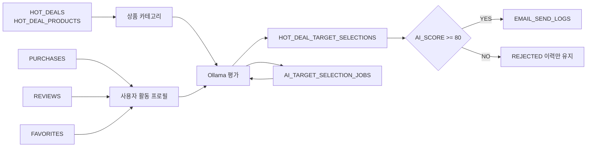

# Phase 2 AI 대상 선정 ERD

## 1. ERD

```mermaid
erDiagram
    USERS {
        NUMBER ID PK
        VARCHAR2 EMAIL UK
        VARCHAR2 NAME
        VARCHAR2 GENDER
        DATE BIRTH
        TIMESTAMP DELETED_AT
    }

    CATEGORIES {
        NUMBER ID PK
        VARCHAR2 NAME UK
    }

    PRODUCTS {
        NUMBER ID PK
        NUMBER CATEGORY_ID FK
        VARCHAR2 NAME
        NUMBER PRICE
        VARCHAR2 STATUS
    }

    PRODUCT_OPTIONS {
        NUMBER ID PK
        NUMBER PRODUCT_ID FK
        NUMBER STOCK
        DATE EXPIRE_DATE
    }

    PURCHASES {
        NUMBER ID PK
        NUMBER USER_ID FK
        NUMBER PRODUCT_ID FK
        NUMBER QUANTITY
        NUMBER PURCHASE_PRICE
        TIMESTAMP CREATED_AT
    }

    REVIEWS {
        NUMBER ID PK
        NUMBER USER_ID FK
        NUMBER PRODUCT_ID FK
        NUMBER PURCHASE_ID FK_UK
        NUMBER RATING
        TIMESTAMP CREATED_AT
        TIMESTAMP DELETED_AT
    }

    FAVORITES {
        NUMBER USER_ID PK_FK
        NUMBER PRODUCT_ID PK_FK
        TIMESTAMP CREATED_AT
    }

    HOT_DEALS {
        NUMBER ID PK
        NUMBER CREATED_BY FK
        VARCHAR2 TITLE
        CLOB DESCRIPTION
        TIMESTAMP STARTS_AT
        TIMESTAMP ENDS_AT
        VARCHAR2 STATUS
    }

    HOT_DEAL_PRODUCTS {
        NUMBER HOT_DEAL_ID PK_FK
        NUMBER PRODUCT_OPTION_ID PK_FK
        NUMBER ORIGINAL_PRICE
        NUMBER HOT_DEAL_PRICE
    }

    AI_TARGET_SELECTION_JOBS {
        NUMBER ID PK
        NUMBER HOT_DEAL_ID FK_UK
        VARCHAR2 STATUS
        NUMBER CANDIDATE_COUNT
        NUMBER SELECTED_COUNT
        NUMBER INSERTED_COUNT
        NUMBER RETRY_COUNT
        NUMBER MAX_RETRY_COUNT
        TIMESTAMP NEXT_RETRY_AT
        TIMESTAMP STARTED_AT
        TIMESTAMP COMPLETED_AT
        CLOB FAILURE_REASON
        TIMESTAMP CREATED_AT
        TIMESTAMP UPDATED_AT
    }

    HOT_DEAL_TARGET_SELECTIONS {
        NUMBER ID PK
        NUMBER HOT_DEAL_ID FK_UK
        NUMBER USER_ID FK_UK
        NUMBER AI_SCORE
        CLOB SELECTION_REASON
        VARCHAR2 DECISION
        TIMESTAMP EVALUATED_AT
        TIMESTAMP CREATED_AT
        TIMESTAMP UPDATED_AT
    }

    EMAIL_SEND_LOGS {
        NUMBER ID PK
        NUMBER HOT_DEAL_ID FK_UK
        NUMBER USER_ID FK_UK
        VARCHAR2 RECIPIENT_EMAIL
        VARCHAR2 TITLE
        CLOB CONTENT
        VARCHAR2 STATUS
        NUMBER RETRY_COUNT
        CLOB FAILURE_REASON
    }

    USERS ||--o{ PURCHASES : purchases
    USERS ||--o{ REVIEWS : writes
    USERS ||--o{ FAVORITES : favorites
    USERS ||--o{ HOT_DEALS : creates
    USERS ||--o{ HOT_DEAL_TARGET_SELECTIONS : evaluated
    USERS ||--o{ EMAIL_SEND_LOGS : receives

    CATEGORIES ||--o{ PRODUCTS : classifies
    PRODUCTS ||--o{ PRODUCT_OPTIONS : has
    PRODUCTS ||--o{ PURCHASES : purchased
    PRODUCTS ||--o{ REVIEWS : reviewed
    PRODUCTS ||--o{ FAVORITES : favorited

    HOT_DEALS ||--|{ HOT_DEAL_PRODUCTS : contains
    PRODUCT_OPTIONS ||--o{ HOT_DEAL_PRODUCTS : discounted

    HOT_DEALS ||--o| AI_TARGET_SELECTION_JOBS : schedules
    HOT_DEALS ||--o{ HOT_DEAL_TARGET_SELECTIONS : evaluates
    HOT_DEALS ||--o{ EMAIL_SEND_LOGS : sends
```

## 2. Phase 2에서 새로 추가된 관계

```text
HOT_DEALS 1 ─ 0..1 AI_TARGET_SELECTION_JOBS
```

- 핫딜 하나당 대상 선정 Job은 최대 하나다.
- `UK_AI_TARGET_JOB_HOT_DEAL`이 중복 Job 생성을 막는다.
- 핫딜이 물리 삭제되면 Job도 `ON DELETE CASCADE`로 제거된다.

```text
HOT_DEALS 1 ─ N HOT_DEAL_TARGET_SELECTIONS
USERS     1 ─ N HOT_DEAL_TARGET_SELECTIONS
```

- 한 핫딜은 여러 사용자를 평가한다.
- 사용자 한 명은 여러 핫딜에서 평가될 수 있다.
- 같은 핫딜에서 같은 사용자는 한 번만 존재한다.
- `(HOT_DEAL_ID, USER_ID)` UNIQUE와 Oracle `MERGE`가 재처리 중복을 막는다.

```text
HOT_DEALS 1 ─ N EMAIL_SEND_LOGS
USERS     1 ─ N EMAIL_SEND_LOGS
```

- 최종 `SELECTED` 사용자만 발송 대기 로그가 생성된다.
- `(HOT_DEAL_ID, USER_ID)` UNIQUE가 같은 핫딜 이메일 중복 생성을 DB 수준에서 막는다.

## 3. 데이터가 이동하는 방향



## 4. 인덱스

### `IDX_AI_TARGET_JOB_STATUS (STATUS, NEXT_RETRY_AT)`

사용 SQL:

```sql
WHERE STATUS = 'PENDING'
   OR (
       STATUS = 'RETRY_WAIT'
       AND NEXT_RETRY_AT <= SYSTIMESTAMP
   )
```

스케줄러가 5초마다 실행하므로 가장 자주 반복되는 Job 검색 조건에 맞춰 생성했다.

### `IDX_HD_TARGET_DECISION (HOT_DEAL_ID, DECISION)`

사용 SQL 예:

```sql
WHERE HOT_DEAL_ID = :hotDealId
  AND DECISION = 'SELECTED'
```

관리자 화면에서 특정 핫딜의 선정·탈락 사용자를 나눠 조회할 때 사용한다.

### `UK_ESL_HOT_DEAL_USER (HOT_DEAL_ID, USER_ID)`

UNIQUE 제약이 생성하는 UNIQUE 인덱스다.

애플리케이션의 `NOT EXISTS`는 일반적인 중복을 막고, UNIQUE 제약은 다중 인스턴스가 동시에 INSERT하는 경쟁 상황까지 최종 방어한다.

## 5. 테이블을 세 개로 분리한 이유

| 테이블 | 답하는 질문 |
|---|---|
| `AI_TARGET_SELECTION_JOBS` | 대상 선정 작업이 언제, 몇 번, 성공/실패했는가? |
| `HOT_DEAL_TARGET_SELECTIONS` | 사용자가 몇 점을 받았고 왜 선정/탈락했는가? |
| `EMAIL_SEND_LOGS` | 선정된 사용자에게 이메일을 실제로 보냈는가? |

작업 상태, AI 판단, 이메일 발송은 변경 시점과 실패 원인이 다르다. 하나의 테이블로 합치면 상태값과 nullable 컬럼이 늘고, 탈락 사용자를 표현하기 위해 가짜 발송 로그를 만들어야 하므로 분리했다.
