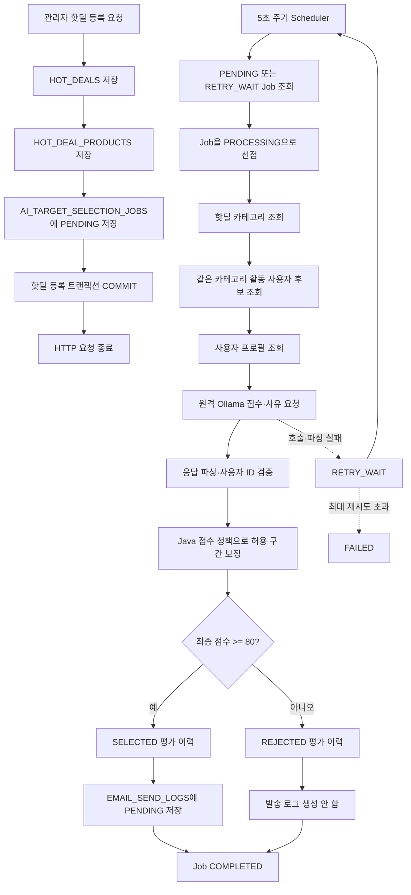
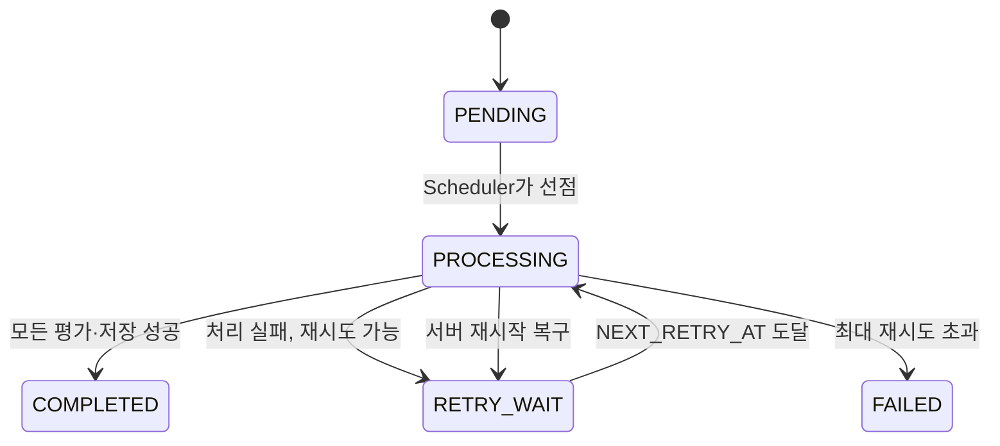
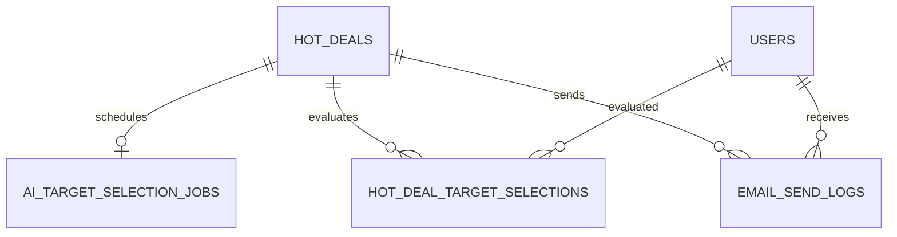

# Phase 2. AI 기반 이메일 발송 대상 선정

> 이슈: `feat(#20): Spring AI 기반 이메일 발송 대상 선정 기능 구현`

## 1. 이 문서의 목적

이 문서는 핫딜을 등록했을 때 AI가 이메일 발송 대상을 선정하는 Phase 2 구현을 설명한다.

문서를 읽은 개발자가 다음 질문에 답할 수 있는 것을 목표로 한다.

- 핫딜 등록 요청이 끝난 뒤 AI 작업은 누가 시작하는가?
- RabbitMQ 없이도 서버 재시작 후 작업을 이어갈 수 있는 이유는 무엇인가?
- 어떤 사용자가 AI 평가 후보가 되는가?
- AI가 반환한 점수를 왜 그대로 사용하지 않는가?
- `score >= 80` 규칙은 정확히 어디에서 적용되는가?
- Job 테이블, 선정 이력 테이블, 이메일 발송 로그 테이블은 각각 왜 필요한가?
- 성공·실패 여부를 어떤 순서로 확인해야 하는가?

---

## 2. 한 문장으로 이해하기

관리자가 핫딜을 등록하면 같은 트랜잭션에서 **AI 대상 선정 작업표(Job)** 를 DB에 남기고, 백그라운드 스케줄러가 작업표를 가져가 사용자 활동을 조회한 뒤 Ollama에게 점수와 사유를 요청한다. Spring Boot는 AI 응답을 검증·보정하고 80점 이상 사용자만 `EMAIL_SEND_LOGS`에 발송 대기 상태로 저장한다.

핵심 책임은 다음과 같이 나뉜다.

| 담당 | 책임 |
|---|---|
| Oracle DB | 해야 할 작업과 처리 결과를 영속적으로 보관 |
| Spring Scheduler | 실행 가능한 DB Job을 주기적으로 찾음 |
| Spring Boot | 후보 조회, 응답 검증, 점수 정책, 80점 필터, 저장 |
| 원격 Ollama | 사용자 활동을 해석하여 원점수와 선정 사유 생성 |
| RabbitMQ | Phase 2에서는 사용하지 않음 |

---

## 3. 왜 `@Async` 대신 DB Job을 사용하는가?

단순 `@Async`는 작업이 애플리케이션 메모리에만 존재한다.

```text
핫딜 저장
→ @Async 실행
→ AI 호출 중 서버 종료
→ 메모리에 있던 작업 소멸
```

DB Job 방식에서는 해야 할 일이 DB에 남는다.

```text
핫딜 저장
→ AI_TARGET_SELECTION_JOBS에 PENDING 저장
→ 서버 종료
→ DB의 PENDING 작업은 그대로 존재
→ 서버 재시작
→ 스케줄러가 다시 조회하여 처리
```

RabbitMQ 없이도 다음 기능을 확보하기 위해 DB Job 방식을 선택했다.

- 요청과 AI 작업의 분리
- 서버 재시작 후 복구
- 자동 재시도
- 중복 실행 방지
- 진행 상태 조회
- 실패 원인 보관

DB Job은 RabbitMQ를 완전히 대체하는 범용 메시지 브로커가 아니다. 현재 규모에서 Phase 2 대상 선정 작업을 안전하게 처리하기 위한 간단한 영속 작업 큐다.

---

## 4. 전체 구조



---

## 5. 실제 작동 순서

### 5.0 먼저 IDE에서 이 순서로 파일을 연다

글만 읽지 말고 다음 순서대로 파일을 열어 메서드 호출을 따라가면 된다. 각 단계의 숫자가 실제 호출 순서다.

```text
1. AdminHotDealRestController.createHotDeal()
   ↓
2. AdminHotDealService.createHotDeal()
   ↓
3. TargetSelectionJobRegistrar.register()
   ↓
4. TargetSelectionJobMapper.xml.insertPendingJob
   ↓ 관리자 HTTP 트랜잭션 COMMIT 및 응답 종료

5. TargetSelectionJobScheduler.processNextJob()
   ↓
6. TargetSelectionJobProcessor.processNextJob()
   ├─ TargetSelectionJobMapper.xml.findNextRunnableJob
   └─ TargetSelectionJobMapper.xml.claimJob
   ↓
7. TargetUserSelectionAiService.selectAndSaveTargets()
   ├─ HotDealTargetMapper.xml.findCategoryIdsByHotDealId
   ├─ HotDealTargetMapper.xml.findCandidateUserIds
   ├─ HotDealTargetMapper.xml.findHotDealInfo
   ├─ HotDealTargetMapper.xml.findHotDealProducts
   └─ HotDealTargetMapper.xml.findUserProfilesByIds
   ↓
8. TargetSelectionPromptBuilder.build()
   ↓
9. TargetUserScoringAiClient.score()
   ├─ 원격 Ollama 호출
   ├─ TargetScoreResponseParser.parse()
   └─ 사용자 ID·점수·사유 검증
   ↓
10. TargetScorePolicy.normalize()
    ↓
11. TargetUserSelectionAiService에서 score >= 80 판정
    ↓
12. TargetSelectionPersistenceService.save()
    ├─ TargetSelectionHistoryMapper.xml.upsertEvaluations
    └─ EmailSendLogMapper.xml.insertPendingLogs
    ↓
13. TargetSelectionJobMapper.xml.markCompleted
```

IDE breakpoint는 다음 위치에 순서대로 설정하면 된다.

| 순서 | 파일 | breakpoint |
|---:|---|---|
| 1 | `AdminHotDealRestController.java` | `adminHotDealService.createHotDeal(request)` |
| 2 | `AdminHotDealService.java` | `insertHotDeal`, `insertHotDealProduct`, `registrar.register` |
| 3 | `TargetSelectionJobRegistrar.java` | `jobMapper.insertPendingJob` |
| 4 | `TargetSelectionJobScheduler.java` | `jobProcessor.processNextJob()` |
| 5 | `TargetSelectionJobProcessor.java` | `findNextRunnableJob`, `claimJob` |
| 6 | `TargetUserSelectionAiService.java` | `findCandidateUserIds`, `selectBatch` |
| 7 | `TargetUserScoringAiClient.java` | `chatClient.prompt()` |
| 8 | `TargetScoreResponseParser.java` | `parse()` |
| 9 | `TargetScorePolicy.java` | `normalize()` |
| 10 | `TargetUserSelectionAiService.java` | `normalizedScore.score() >= scoreThreshold` |
| 11 | `TargetSelectionPersistenceService.java` | `historyMapper`, `emailSendLogMapper` |
| 12 | `TargetSelectionJobProcessor.java` | `markCompleted` 또는 `markFailed` |

다음 절부터는 위 순서를 실제 코드로 따라간다.

#### 코드 흐름 1: Controller가 서비스로 요청을 전달한다

파일: `src/main/java/kr/or/hieating/hotdeal/admin/controller/AdminHotDealRestController.java`

```java
@PostMapping
public ApiResponse<Integer> createHotDeal(
    @RequestBody @Valid HotDealCreateRequestDTO request) {
  int newHotDealId = adminHotDealService.createHotDeal(request);
  return ApiResponse.onSuccess(newHotDealId);
}
```

여기에는 AI 로직이 없다. HTTP JSON을 DTO로 받고 서비스 호출 결과인 핫딜 ID를 응답한다.

디버거에서 `Step Into`를 누르면 `AdminHotDealService.createHotDeal()`로 이동한다.

#### 코드 흐름 2: 핫딜·상품·Job을 같은 트랜잭션에 저장한다

파일: `src/main/java/kr/or/hieating/hotdeal/admin/service/AdminHotDealService.java`

흐름과 직접 관계된 `createHotDeal()` 메서드 전체를 순서대로 보면 다음과 같다.

```java
@Transactional
public int createHotDeal(HotDealCreateRequestDTO request) {
  LocalDate today = LocalDate.now();

  if (request.getStartsAt().isBefore(today)) {
    throw new GeneralException(ErrorStatus.INVALID_START_DATE);
  }
  if (request.getEndsAt().isBefore(request.getStartsAt())) {
    throw new GeneralException(ErrorStatus.INVALID_END_DATE);
  }

  List<Integer> productOptionIds =
      request.getProducts().stream()
          .map(HotDealCreateRequestDTO.ProductItemDTO::getProductOptionId)
          .toList();
  if (adminHotDealMapper.countExpiredProductOptions(productOptionIds) > 0) {
    throw new GeneralException(ErrorStatus._BAD_REQUEST);
  }

  String status = request.getStartsAt().isAfter(today) ? "SCHEDULED" : "ACTIVE";
  int adminUserId = Math.toIntExact(userResolver.requireCurrentUserId());

  HotDeals hotDeal =
      HotDeals.builder()
          .title(request.getTitle())
          .description(request.getDescription())
          .startsAt(request.getStartsAt().atStartOfDay())
          .endsAt(request.getEndsAt().atTime(23, 59, 59))
          .status(status)
          .createdBy(adminUserId)
          .build();

  adminHotDealMapper.insertHotDeal(hotDeal);
  int hotDealId = hotDeal.getId();

  double discountMultiplier = (100 - request.getDiscountRate()) / 100.0;

  for (HotDealCreateRequestDTO.ProductItemDTO item : request.getProducts()) {
    int calculatedPrice = (int) (item.getOriginalPrice() * discountMultiplier);
    int finalHotDealPrice = (int) (Math.round(calculatedPrice / 10.0) * 10);

    HotDealProducts child =
        HotDealProducts.builder()
            .hotDealId(hotDealId)
            .productOptionId(item.getProductOptionId())
            .originalPrice(item.getOriginalPrice())
            .hotDealPrice(finalHotDealPrice)
            .build();

    adminHotDealMapper.insertHotDealProduct(child);
  }

  targetSelectionJobRegistrar.ifAvailable(registrar -> registrar.register(hotDealId));
  return hotDealId;
}
```

코드를 세 덩어리로 보면 쉽다.

```text
입력 검증
→ HOT_DEALS / HOT_DEAL_PRODUCTS 저장
→ 대상 선정 Job 등록
```

`@Transactional`이 메서드 전체를 감싸므로 마지막 Job 등록까지 성공해야 핫딜도 커밋된다.

#### 코드 흐름 3: Job 등록 서비스가 MyBatis Mapper를 호출한다

파일: `src/main/java/kr/or/hieating/ai/service/TargetSelectionJobRegistrar.java`

```java
public void register(long hotDealId) {
  jobMapper.insertPendingJob(
      hotDealId,
      properties.targetSelection().jobMaxRetries());
}
```

이 클래스는 “핫딜이 생성됐으니 대상 선정 작업표를 한 장 만든다”는 역할만 담당한다. Ollama는 아직 호출하지 않는다.

#### 코드 흐름 4: 실제 INSERT SQL이 PENDING Job을 만든다

파일: `src/main/resources/mappers/ai/TargetSelectionJobMapper.xml`

```xml
<insert id="insertPendingJob">
    INSERT INTO ai_target_selection_jobs (
        hot_deal_id,
        status,
        max_retry_count
    )
    SELECT
        #{hotDealId},
        'PENDING',
        #{maxRetryCount}
    FROM dual
    WHERE NOT EXISTS (
        SELECT 1
        FROM ai_target_selection_jobs
        WHERE hot_deal_id = #{hotDealId}
    )
</insert>
```

이 SQL이 끝나면 관리자 요청 트랜잭션이 커밋되고 Controller가 `hotDealId`를 반환한다.

여기까지가 관리자 HTTP 요청 스레드다. 아래부터는 별도 Scheduler 스레드다.

#### 코드 흐름 5: Scheduler가 처리할 Job이 있는지 주기적으로 확인한다

파일: `src/main/java/kr/or/hieating/ai/scheduler/TargetSelectionJobScheduler.java`

```java
@EventListener(ApplicationReadyEvent.class)
public void recoverInterruptedJobs() {
  int recoveredCount = jobProcessor.recoverInterruptedJobs();
  if (recoveredCount > 0) {
    log.warn(
        "[대상선정 Job] 애플리케이션 재시작으로 중단된 작업 {}건을 재시도 대기로 복구했습니다.",
        recoveredCount);
  }
}

@Scheduled(fixedDelayString = "${greenfood.ai.target-selection.job-poll-delay:5s}")
public void processNextJob() {
  jobProcessor.processNextJob();
}
```

두 메서드의 호출 시점이 다르다.

```text
서버 시작 직후 → recoverInterruptedJobs()
5초 주기      → processNextJob()
```

#### 코드 흐름 6: Processor가 Job을 선점하고 성공·실패 상태를 책임진다

파일: `src/main/java/kr/or/hieating/ai/service/TargetSelectionJobProcessor.java`

```java
public void processNextJob() {
  TargetSelectionJobDto job = jobMapper.findNextRunnableJob();
  if (job == null || jobMapper.claimJob(job.id()) != 1) {
    return;
  }

  try {
    TargetSelectionResult result =
        selectionService.selectAndSaveTargets(job.hotDealId());

    jobMapper.markCompleted(
        job.id(),
        result.candidateCount(),
        result.selectedCount(),
        result.insertedCount());
  } catch (RuntimeException exception) {
    String failureReason = abbreviate(buildFailureReason(exception));
    jobMapper.markFailed(job.id(), failureReason);
  }
}
```

여기서 반드시 `find → claim → execute` 순서로 간다.

```text
findNextRunnableJob() → 실행 후보 조회
claimJob()            → PROCESSING으로 조건부 변경
selectAndSaveTargets  → 실제 AI 대상 선정
markCompleted/Failed  → 최종 상태 저장
```

`claimJob()` 결과가 1이 아니면 다른 실행자가 먼저 상태를 바꾼 것이므로 처리하지 않는다.

#### 코드 흐름 7: 실행 가능한 Job 조회와 선점 SQL을 확인한다

파일: `src/main/resources/mappers/ai/TargetSelectionJobMapper.xml`

```xml
<select id="findNextRunnableJob"
        resultType="kr.or.hieating.ai.dto.TargetSelectionJobDto">
    SELECT id, hot_deal_id AS hotDealId, status,
           retry_count AS retryCount,
           max_retry_count AS maxRetryCount
    FROM (
        SELECT id, hot_deal_id, status, retry_count, max_retry_count
        FROM ai_target_selection_jobs
        WHERE status = 'PENDING'
           OR (
                status = 'RETRY_WAIT'
                AND (next_retry_at IS NULL OR next_retry_at &lt;= SYSTIMESTAMP)
           )
        ORDER BY created_at, id
    )
    WHERE ROWNUM = 1
</select>
```

```xml
<update id="claimJob">
    UPDATE ai_target_selection_jobs
    SET status = 'PROCESSING',
        started_at = SYSTIMESTAMP,
        failure_reason = NULL,
        next_retry_at = NULL,
        updated_at = SYSTIMESTAMP
    WHERE id = #{jobId}
      AND (
          status = 'PENDING'
          OR (
              status = 'RETRY_WAIT'
              AND (next_retry_at IS NULL OR next_retry_at &lt;= SYSTIMESTAMP)
          )
      )
</update>
```

조회만으로는 선점이 아니다. 상태 조건이 들어간 `UPDATE`가 성공해야 해당 실행자가 Job을 가져간 것이다.

#### 코드 흐름 8: 핵심 서비스가 DB 조회 순서를 결정한다

파일: `src/main/java/kr/or/hieating/ai/service/TargetUserSelectionAiService.java`

```java
public TargetSelectionResult selectAndSaveTargets(long hotDealId) {
  AiProperties.TargetSelection settings = properties.targetSelection();

  List<Long> categoryIds =
      hotDealTargetMapper.findCategoryIdsByHotDealId(hotDealId);
  if (categoryIds.isEmpty()) {
    return TargetSelectionResult.empty(hotDealId);
  }

  List<Long> candidateIds =
      hotDealTargetMapper.findCandidateUserIds(
          categoryIds,
          settings.recentMonths());
  if (candidateIds.isEmpty()) {
    return TargetSelectionResult.empty(hotDealId);
  }

  HotDealInfoRow hotDealRow =
      hotDealTargetMapper.findHotDealInfo(hotDealId);
  if (hotDealRow == null) {
    throw new IllegalStateException(
        "대상 선정용 핫딜 정보를 찾을 수 없습니다. hotDealId=" + hotDealId);
  }

  HotDealTargetInfoDto hotDeal =
      HotDealTargetInfoDto.from(
          hotDealRow,
          hotDealTargetMapper.findHotDealProducts(hotDealId));

  Map<Long, TargetSelectionEvaluationDto> evaluationsByUserId =
      new LinkedHashMap<>();
  Map<Long, TargetUserDto> selectedByUserId =
      new LinkedHashMap<>();

  for (int start = 0;
       start < candidateIds.size();
       start += settings.batchSize()) {
    int end = Math.min(
        start + settings.batchSize(),
        candidateIds.size());
    List<Long> batchIds = candidateIds.subList(start, end);

    selectBatch(
        hotDeal,
        batchIds,
        settings,
        evaluationsByUserId,
        selectedByUserId);
  }

  List<TargetSelectionEvaluationDto> evaluations =
      new ArrayList<>(evaluationsByUserId.values());
  List<TargetUserDto> targets =
      new ArrayList<>(selectedByUserId.values());

  int insertedCount =
      persistenceService.save(hotDealId, evaluations, targets);

  return new TargetSelectionResult(
      hotDealId,
      candidateIds.size(),
      targets.size(),
      insertedCount);
}
```

이 메서드는 실제 작업 순서를 읽을 수 있는 목차 역할을 한다.

```text
카테고리
→ 후보 ID
→ 핫딜 정보
→ 사용자별 배치 평가
→ 전체 결과 저장
→ 집계 반환
```

#### 코드 흐름 9: 후보 SQL이 “누구를 AI에게 보낼지” 1차로 줄인다

파일: `src/main/resources/mappers/ai/HotDealTargetMapper.xml`

```xml
<select id="findCandidateUserIds" resultType="long">
    SELECT u.id
    FROM users u
    WHERE u.deleted_at IS NULL
      AND (
        EXISTS (
            SELECT 1
            FROM purchases pu
            INNER JOIN products p ON p.id = pu.product_id
            WHERE pu.user_id = u.id
              AND pu.created_at >= ADD_MONTHS(SYSTIMESTAMP, -#{recentMonths})
              AND p.category_id IN (...)
        )
        OR EXISTS (
            SELECT 1
            FROM reviews r
            INNER JOIN products p ON p.id = r.product_id
            WHERE r.user_id = u.id
              AND r.deleted_at IS NULL
              AND r.created_at >= ADD_MONTHS(SYSTIMESTAMP, -#{recentMonths})
              AND p.category_id IN (...)
        )
        OR EXISTS (
            SELECT 1
            FROM favorites f
            INNER JOIN products p ON p.id = f.product_id
            WHERE f.user_id = u.id
              AND p.category_id IN (...)
        )
      )
    ORDER BY u.id
</select>
```

이 SQL은 전체 사용자를 무조건 Ollama에 보내지 않는다. 핫딜 카테고리에 구매·리뷰·즐겨찾기 중 하나라도 있는 사람만 AI 후보가 된다.

#### 코드 흐름 10: `selectBatch()` 안에서 프로필→AI→점수 보정→80점 판정이 이어진다

파일: `TargetUserSelectionAiService.java`

```java
private void selectBatch(
    HotDealTargetInfoDto hotDeal,
    List<Long> batchIds,
    AiProperties.TargetSelection settings,
    Map<Long, TargetSelectionEvaluationDto> evaluationsByUserId,
    Map<Long, TargetUserDto> selectedByUserId) {

  List<UserProfileRow> rows =
      hotDealTargetMapper.findUserProfilesByIds(
          batchIds,
          settings.recentMonths());

  Map<Long, UserProfileRow> profilesById = new HashMap<>();
  Map<Long, UserProfileDto> profileDtosById = new HashMap<>();
  List<UserProfileDto> profiles = new ArrayList<>();

  for (UserProfileRow row : rows) {
    UserProfileDto profile = UserProfileDto.from(row);
    profilesById.put(row.userId(), row);
    profileDtosById.put(row.userId(), profile);
    profiles.add(profile);
  }

  List<UserScoreDto> scores =
      scoringClient.score(hotDeal, profiles);

  for (UserScoreDto score : scores) {
    UserProfileRow profile = profilesById.get(score.userId());

    UserScoreDto normalizedScore =
        scorePolicy.normalize(
            hotDeal,
            profileDtosById.get(score.userId()),
            score);

    boolean selected =
        normalizedScore.score() >= settings.scoreThreshold();

    evaluationsByUserId.putIfAbsent(
        score.userId(),
        new TargetSelectionEvaluationDto(
            score.userId(),
            normalizedScore.score(),
            normalizedScore.reason(),
            selected ? "SELECTED" : "REJECTED"));

    if (selected) {
      selectedByUserId.putIfAbsent(
          score.userId(),
          new TargetUserDto(
              score.userId(),
              profile.email(),
              normalizedScore.score(),
              normalizedScore.reason()));
    }
  }
}
```

여기서 가장 중요한 두 줄은 다음이다.

```java
UserScoreDto normalizedScore = scorePolicy.normalize(...);
boolean selected = normalizedScore.score() >= settings.scoreThreshold();
```

AI가 반환한 원점수를 Java 정책으로 먼저 보정하고, 그 다음 80점 규칙을 적용한다.

#### 코드 흐름 11: 프롬프트 생성 후 원격 Ollama를 호출한다

파일: `TargetUserScoringAiClient.java`

```java
public List<UserScoreDto> score(
    HotDealTargetInfoDto hotDeal,
    List<UserProfileDto> userProfiles) {

  String userPrompt =
      promptBuilder.build(hotDeal, userProfiles);
  RuntimeException lastFailure = null;

  for (int attempt = 0; attempt <= retryCount; attempt++) {
    try {
      String response =
          chatClient
              .prompt()
              .system(promptBuilder.systemPrompt())
              .user(userPrompt)
              .call()
              .content();

      List<UserScoreDto> scores =
          responseParser.parse(response);

      scores =
          remapSingleUserResponse(userProfiles, scores);

      validateCompleteResponse(userProfiles, scores);
      return scores;
    } catch (RuntimeException exception) {
      lastFailure = exception;
    }
  }

  throw new IllegalStateException(
      "AI 대상 선정 재시도 횟수를 초과했습니다. 마지막 오류: "
          + lastFailure.getMessage(),
      lastFailure);
}
```

이 코드에서 확인할 값:

```text
userPrompt → DB 데이터를 JSON으로 만든 입력
response   → Ollama 원문 응답
scores     → 파싱·사용자 ID 보호가 끝난 결과
```

#### 코드 흐름 12: Parser가 Ollama 응답 모양을 복구한다

파일: `TargetScoreResponseParser.java`

```java
public List<UserScoreDto> parse(String rawResponse) {
  if (!StringUtils.hasText(rawResponse)) {
    throw new IllegalStateException("AI 대상 선정 응답이 비어 있습니다.");
  }

  String cleaned = extractJson(rawResponse);

  try {
    JsonNode root = objectMapper.readTree(cleaned);
    List<UserScoreDto> scores = new ArrayList<>();

    for (JsonNode node : root) {
      scores.add(
          new UserScoreDto(
              readLong(node.get("userId")),
              readInteger(node.get("score")),
              readReason(node.get("reason"))));
    }
    return scores;
  } catch (JsonProcessingException exception) {
    throw new IllegalStateException(
        "AI 대상 선정 응답 JSON 파싱에 실패했습니다.",
        exception);
  }
}
```

Parser는 JSON 형식만 복구한다. 사용자 ID가 실제 후보와 같은지, 점수가 0~100인지 검증하는 책임은 `TargetUserScoringAiClient`에 있다.

#### 코드 흐름 13: Java가 AI 점수를 실제 활동 구간으로 제한한다

파일: `TargetScorePolicy.java`

```java
public UserScoreDto normalize(
    HotDealTargetInfoDto hotDeal,
    UserProfileDto profile,
    UserScoreDto aiScore) {

  ScoreRange range =
      determineRange(hotDeal.categoryNames(), profile);

  int normalizedScore =
      Math.max(
          range.minimum(),
          Math.min(range.maximum(), aiScore.score()));

  String evidence =
      "구매 %d회, 리뷰 %d회, 즐겨찾기 %d회. AI 판단: %s"
          .formatted(
              profile.purchaseCount(),
              profile.reviewCount(),
              profile.favoriteCount(),
              aiScore.reason().trim());

  return new UserScoreDto(
      aiScore.userId(),
      normalizedScore,
      evidence);
}
```

```java
private ScoreRange determineRange(
    List<String> hotDealCategories,
    UserProfileDto profile) {

  boolean purchasedCategoryMatches =
      intersects(hotDealCategories, profile.purchaseCategories());
  boolean reviewedCategoryMatches =
      intersects(hotDealCategories, profile.reviewCategories());
  boolean favoriteCategoryMatches =
      intersects(hotDealCategories, profile.favoriteCategories());

  if (purchasedCategoryMatches
      && profile.purchaseCount() >= 3
      && (reviewedCategoryMatches || favoriteCategoryMatches)) {
    return new ScoreRange(90, 100);
  }
  if (purchasedCategoryMatches
      && (profile.purchaseCount() >= 2
          || (reviewedCategoryMatches && favoriteCategoryMatches))) {
    return new ScoreRange(80, 89);
  }
  if (purchasedCategoryMatches
      && profile.purchaseCount() >= 1) {
    return new ScoreRange(60, 79);
  }
  return new ScoreRange(0, 59);
}
```

#### 코드 흐름 14: 전체 평가와 선정 사용자 발송 대기를 한 번에 저장한다

파일: `TargetSelectionPersistenceService.java`

```java
@Transactional
public int save(
    long hotDealId,
    List<TargetSelectionEvaluationDto> evaluations,
    List<TargetUserDto> targets) {

  if (!evaluations.isEmpty()) {
    historyMapper.upsertEvaluations(
        hotDealId,
        evaluations);
  }

  return targets.isEmpty()
      ? 0
      : emailSendLogMapper.insertPendingLogs(
          hotDealId,
          targets);
}
```

두 Mapper 호출은 같은 트랜잭션이다.

```text
전체 평가 이력 저장
→ SELECTED 사용자 이메일 발송 대기 저장
→ 둘 다 성공하면 COMMIT
```

#### 코드 흐름 15: DB 저장 SQL과 Job 완료 SQL을 확인한다

평가 이력은 `MERGE`한다.

```xml
MERGE INTO hot_deal_target_selections target
USING (...) source
ON (
    target.hot_deal_id = source.hot_deal_id
    AND target.user_id = source.user_id
)
WHEN MATCHED THEN UPDATE SET ...
WHEN NOT MATCHED THEN INSERT (...);
```

선정 사용자만 발송 대기로 저장한다.

```xml
INSERT INTO email_send_logs (...)
SELECT ...
FROM (...) target
WHERE NOT EXISTS (
    SELECT 1
    FROM email_send_logs existing
    WHERE existing.hot_deal_id = #{hotDealId}
      AND existing.user_id = target.user_id
)
```

마지막으로 Processor가 Job을 완료한다.

```xml
UPDATE ai_target_selection_jobs
SET status = 'COMPLETED',
    candidate_count = #{candidateCount},
    selected_count = #{selectedCount},
    inserted_count = #{insertedCount},
    completed_at = SYSTIMESTAMP,
    failure_reason = NULL,
    next_retry_at = NULL,
    updated_at = SYSTIMESTAMP
WHERE id = #{jobId}
  AND status = 'PROCESSING'
```

이 지점까지 도달하면 하나의 대상 선정 Job 흐름이 끝난다.

### 5.1 관리자 요청 스레드

`AdminHotDealService.createHotDeal()`에서 다음 작업을 하나의 트랜잭션으로 처리한다.

1. 입력 날짜와 상품 옵션을 검증한다.
2. `HOT_DEALS`에 핫딜을 저장한다.
3. `HOT_DEAL_PRODUCTS`에 핫딜 상품을 저장한다.
4. `AI_TARGET_SELECTION_JOBS`에 `PENDING` Job을 저장한다.
5. 트랜잭션을 커밋한다.
6. 생성한 `hotDealId`를 관리자 요청에 반환한다.

여기서는 Ollama를 호출하지 않는다. 따라서 Ollama가 느려도 핫딜 등록 HTTP 요청이 AI 응답 시간만큼 대기하지 않는다.

핫딜과 Job을 같은 트랜잭션에 저장하는 이유는 데이터 정합성 때문이다.

```text
핫딜 저장 성공 + Job 저장 성공 → 둘 다 COMMIT
핫딜 저장 성공 + Job 저장 실패 → 둘 다 ROLLBACK
```

핫딜만 존재하고 대상 선정 Job이 없는 애매한 상태를 방지한다.

### 5.2 백그라운드 스케줄러 스레드

서버가 정상 기동되면 `TargetSelectionJobScheduler`가 5초마다 실행된다.

스케줄러는 다음 상태 중 실행 가능한 Job 한 건을 조회한다.

- `PENDING`
- 재시도 시간이 지난 `RETRY_WAIT`

조회한 Job을 바로 실행하지 않고 먼저 `PROCESSING`으로 변경한다. `UPDATE ... WHERE status IN (...)` 조건을 사용하므로 동일 Job을 다른 실행자가 먼저 가져갔다면 업데이트 결과가 0건이 되고 처리를 중단한다.

### 5.3 후보 사용자 조회

핫딜에 포함된 상품의 카테고리를 조회한 뒤, 해당 카테고리에 다음 활동 중 하나라도 있는 활성 사용자를 후보로 찾는다.

- 최근 N개월 구매 이력
- 최근 N개월 미삭제 리뷰
- 현재 즐겨찾기

기본 조회 기간은 6개월이다.

```properties
greenfood.ai.target-selection.recent-months=6
```

사용자 이름이나 이메일만으로 후보를 만들지 않는다. 실제 상품 카테고리 활동이 있어야 후보가 된다.

### 5.4 사용자 프로필 생성

후보 ID를 기준으로 다음 데이터를 조회한다.

- 성별
- 생년월일
- 최근 구매 카테고리와 구매 횟수
- 최근 리뷰 카테고리와 리뷰 횟수
- 즐겨찾기 카테고리와 즐겨찾기 횟수
- 최근 리뷰 평균 평점

`UserProfileDto`로 변환하면서 다음 가공을 수행한다.

- 생년월일 → 만 나이
- 쉼표 문자열 카테고리 → `List<String>`
- 구매·리뷰·즐겨찾기 카테고리 합집합 → 관심 카테고리
- null 횟수 → 0

이메일 주소는 AI 프롬프트에 포함하지 않는다. 이메일은 최종 선정 사용자를 `EMAIL_SEND_LOGS`에 저장할 때만 사용한다.

### 5.5 Ollama 호출

현재 기본 배치 크기는 1이다.

```properties
greenfood.ai.target-selection.batch-size=1
```

`llama3.2:1b`가 여러 사용자 ID를 누락하거나 다른 사용자 ID를 생성하는 현상이 확인되어 사용자 한 명씩 요청한다.

Ollama는 다음 결과를 생성한다.

```json
[
  {
    "userId": 27,
    "score": 95,
    "reason": "동일 카테고리의 최근 구매와 즐겨찾기 활동이 있습니다."
  }
]
```

### 5.6 AI 응답 방어 처리

소형 LLM은 항상 같은 JSON 모양을 보장하지 않는다. 실제 테스트에서 다음 변형이 발생했다.

- 배열 대신 단일 객체 반환
- `userId`, `score`를 문자열로 반환
- `reason`을 문자열 배열로 반환
- 요청하지 않은 사용자 ID 반환
- 한 명을 요청했는데 여러 결과 반환

현재 구현은 다음과 같이 방어한다.

| AI 응답 문제 | 처리 |
|---|---|
| `[{...}]` 배열 | 정상 파싱 |
| `{...}` 단일 객체 | 배열 한 건으로 변환 |
| `"score":"90"` | 정수 90으로 변환 |
| `"reason":["사유1","사유2"]` | `"사유1 사유2"`로 합침 |
| 잘못된 사용자 ID | 배치 1인 경우 실제 요청 사용자 ID로 강제 매핑 |
| 여러 사용자 결과 생성 | 유효한 한 건만 선택하고 실제 사용자 ID로 매핑 |
| 점수 누락·범위 초과·사유 누락 | 호출 실패로 처리 후 재시도 |
| JSON 자체가 없음 | 파싱 실패로 처리 후 재시도 |

사용자 ID는 AI가 결정하는 값이 아니다. Spring Boot가 DB에서 조회한 실제 사용자 ID가 정답이다. AI는 점수와 해석만 제공한다.

### 5.7 점수 보정

AI 원점수를 그대로 사용하지 않는다. 실제 테스트에서 모든 사용자에게 동일한 96점을 반환하는 문제가 확인됐기 때문이다.

`TargetScorePolicy`가 실제 DB 활동에 따라 AI 점수를 허용 구간 안으로 보정한다.

| 실제 활동 | 허용 점수 |
|---|---:|
| 동일 카테고리 구매 3회 이상 + 리뷰 또는 즐겨찾기 | 90~100 |
| 동일 카테고리 구매 2회 이상 또는 구매·리뷰·즐겨찾기 모두 존재 | 80~89 |
| 동일 카테고리 구매 1회 | 60~79 |
| 동일 카테고리 구매 없이 즐겨찾기만 존재 | 0~59 |

예를 들어 즐겨찾기만 있는 사용자에게 AI가 96점을 줘도 최종 점수는 59점으로 제한된다.

```text
AI 원점수: 96
Java 허용 구간: 0~59
최종 점수: 59
```

반대로 구매 5회인 고활동 사용자에게 AI가 50점을 줘도 정책상 최소 90점으로 보정된다.

최종 사유에는 실제 활동 횟수가 앞에 붙는다.

```text
구매 4회, 리뷰 1회, 즐겨찾기 1회. AI 판단: 동일 카테고리 구매 가능성이 높습니다.
```

따라서 책임은 다음과 같다.

- AI: 활동 의미 해석과 사유 생성
- Spring Boot: 사용자 ID, 점수 범위, 선정 기준을 보장

### 5.8 80점 규칙 적용

최종 대상 선정 규칙은 `TargetUserSelectionAiService`에서 적용한다.

```java
boolean selected = normalizedScore.score() >= settings.scoreThreshold();
```

기본값은 80점이다.

```properties
greenfood.ai.target-selection.score-threshold=80
```

AI가 `SELECTED`라는 결론을 직접 내리지 않는다. AI는 점수와 사유를 제공하고, Spring Boot가 80점 규칙으로 최종 결정한다.

### 5.9 결과 저장

모든 후보 평가가 성공한 후 다음 두 작업을 하나의 트랜잭션으로 저장한다.

1. 전체 후보의 점수·사유·결정을 `HOT_DEAL_TARGET_SELECTIONS`에 저장
2. `SELECTED` 사용자만 `EMAIL_SEND_LOGS`에 `PENDING`으로 저장

후보 3명 중 2명이 선정되면 다음과 같이 된다.

```text
HOT_DEAL_TARGET_SELECTIONS: 3건
  - SELECTED 2건
  - REJECTED 1건

EMAIL_SEND_LOGS: 2건
```

한 배치라도 완전히 처리되지 않으면 저장하지 않는다. 일부 사용자만 저장한 불완전한 선정 결과가 발송 단계로 넘어가는 것을 방지한다.

### 5.10 Job 종료

정상 처리되면 Job에 집계 결과를 저장하고 `COMPLETED`로 변경한다.

```text
CANDIDATE_COUNT = 평가 후보 수
SELECTED_COUNT  = 최종 점수 80점 이상 수
INSERTED_COUNT  = EMAIL_SEND_LOGS에 실제 신규 저장한 수
```

`SELECTED_COUNT`와 `INSERTED_COUNT`가 다를 수 있다. 같은 핫딜·사용자의 발송 로그가 이미 존재하면 `NOT EXISTS` 조건으로 중복 삽입하지 않기 때문이다.

---

## 6. 스레드와 트랜잭션 경계

| 구간 | 실행 스레드 | 트랜잭션 |
|---|---|---|
| 핫딜·상품·Job 저장 | 관리자 HTTP 요청 스레드 | 하나의 `@Transactional` |
| Job 조회·선점 | Scheduler 스레드 | 개별 DB 업데이트 |
| DB 조회·Ollama 호출 | Scheduler 스레드 | 장시간 DB 트랜잭션으로 묶지 않음 |
| 평가 이력·발송 대기 저장 | Scheduler 스레드 | `TargetSelectionPersistenceService.save()`의 하나의 트랜잭션 |
| Job 완료·실패 변경 | Scheduler 스레드 | 처리 결과 상태 업데이트 |

AI 호출 전체를 DB 트랜잭션으로 묶지 않는 이유는 원격 호출이 최대 수십 초 걸릴 수 있기 때문이다. 장시간 트랜잭션은 DB 커넥션과 잠금을 오래 점유한다.

평가 이력과 발송 대기 저장만 같은 트랜잭션으로 묶어 다음 원자성을 보장한다.

```text
평가 이력 저장 성공 + 발송 대기 저장 성공 → COMMIT
평가 이력 저장 성공 + 발송 대기 저장 실패 → 둘 다 ROLLBACK
```

---

## 7. Job 상태와 재시도



기본 최대 재시도 횟수는 3회다.

```properties
greenfood.ai.target-selection.job-max-retries=3
```

의미는 최초 실행에 추가 재시도 3회를 허용한다는 것이다.

```text
최초 실패 → RETRY_COUNT 1, 30초 후 재시도
재시도 1 실패 → RETRY_COUNT 2, 60초 후 재시도
재시도 2 실패 → RETRY_COUNT 3, 120초 후 재시도
재시도 3 실패 → RETRY_COUNT 4, FAILED
```

대기 시간은 지수 백오프를 사용하고 최대 600초로 제한한다.

```text
30 * 2^(현재 retry_count) 초
```

서버가 `PROCESSING` 중 종료되면 시작 시 `recoverInterruptedJobs()`가 해당 작업을 `RETRY_WAIT` 또는 `FAILED`로 복구한다.

---

## 8. 파일별 설명

### 8.1 기존 핫딜 코드 수정

#### `AdminHotDealService.java`

역할:

- 핫딜과 핫딜 상품 저장
- 같은 트랜잭션에서 대상 선정 Job 등록

핵심 코드:

```java
targetSelectionJobRegistrar.ifAvailable(registrar -> registrar.register(hotDealId));
```

`ObjectProvider`를 사용하는 이유:

- `greenfood.ai.enabled=false`면 AI 관련 Bean이 생성되지 않는다.
- AI가 비활성화되어도 핫딜 기능 자체는 정상 실행돼야 한다.
- 직접 필수 의존성으로 주입하면 AI 비활성화 환경에서 애플리케이션 기동이 실패할 수 있다.

이 메서드는 AI를 직접 호출하지 않는다. Job만 DB에 등록하고 요청을 끝낸다.

### 8.2 설정

#### `AiConfig.java`

Phase 1에서 생성한 두 ChatClient를 그대로 사용한다.

```text
emailGenerationChatClient → 이후 개인화 이메일 생성용
emailValidationChatClient → Phase 2 대상 적합도 평가용
```

Phase 2의 `TargetUserScoringAiClient`는 `@Qualifier("emailValidationChatClient")`로 검증용 원격 Ollama를 선택한다. `EmailGenerationAiService`와 `EmailValidationAiService`는 Phase 1 서비스이며 현재 대상 선정 Job 흐름에서는 직접 호출하지 않는다.

#### `AiProperties.java`

`greenfood.ai.*` 설정을 타입 안전하게 바인딩하고 애플리케이션 시작 시 값을 검증한다.

`TargetSelection` 설정:

| 필드 | 의미 |
|---|---|
| `scoreThreshold` | 이메일 발송 대상 최소 점수 |
| `batchSize` | 한 번의 AI 호출에 포함할 사용자 수 |
| `recentMonths` | 구매·리뷰 조회 기간 |
| `retryCount` | 한 사용자 AI 호출/파싱 즉시 재시도 횟수 |
| `jobMaxRetries` | Job 전체 재시도 횟수 |

#### `TargetSelectionSchedulingConfig.java`

AI 기능이 활성화됐을 때만 `@EnableScheduling`을 켠다.

```text
greenfood.ai.enabled=true  → 스케줄러 활성화
greenfood.ai.enabled=false → 스케줄러와 AI 대상 선정 Bean 비활성화
```

#### `application.properties`

Phase 2 기본 설정:

```properties
greenfood.ai.target-selection.score-threshold=80
greenfood.ai.target-selection.batch-size=1
greenfood.ai.target-selection.recent-months=6
greenfood.ai.target-selection.retry-count=1
greenfood.ai.target-selection.job-max-retries=3
greenfood.ai.target-selection.job-poll-delay=5s
```

운영에서는 대응 환경 변수로 덮어쓸 수 있다.

### 8.3 Job 등록·스케줄링

#### `TargetSelectionJobRegistrar.java`

핫딜 ID와 최대 재시도 횟수를 받아 `PENDING` Job을 생성한다.

핫딜별 UNIQUE 제약과 `NOT EXISTS` SQL이 있으므로 같은 핫딜에 Job이 중복 생성되지 않는다.

#### `TargetSelectionSchedulingConfig.java`

Spring Scheduling을 활성화하는 설정 클래스다.

#### `TargetSelectionJobScheduler.java`

두 가지 진입점을 가진다.

- `ApplicationReadyEvent`: 서버 시작 시 중단된 `PROCESSING` Job 복구
- `@Scheduled`: 5초마다 다음 실행 가능 Job 처리

현재 Spring 기본 Scheduler를 사용하므로 한 번에 한 Job을 순차 처리한다.

#### `TargetSelectionJobProcessor.java`

Job 실행 상태를 총괄한다.

처리 순서:

1. 실행 가능한 Job 한 건 조회
2. 조건부 UPDATE로 Job 선점
3. `TargetUserSelectionAiService` 호출
4. 성공 시 집계값과 `COMPLETED` 저장
5. 실패 시 전체 예외 원인 체인을 문자열로 저장

실패 원인은 최대 3,500자로 잘라 Oracle CLOB에 저장한다. 상위 예외뿐 아니라 JSON 파싱 오류 같은 마지막 원인도 확인할 수 있다.

### 8.4 핵심 대상 선정 서비스

#### `TargetUserSelectionAiService.java`

Phase 2의 오케스트레이터다.

담당 작업:

1. 핫딜 카테고리 조회
2. 후보 사용자 ID 조회
3. 핫딜·상품 정보 조회
4. 사용자 프로필 조회
5. 배치 분할
6. Ollama 점수 요청
7. 응답 사용자 검증
8. 점수 보정
9. 80점 규칙 적용
10. 평가 이력과 발송 대기 저장
11. 처리 집계 반환

`LinkedHashMap`을 사용하는 이유:

- 사용자 ID별 중복 결과 방지
- 조회·평가 순서 유지

후보 프로필이나 AI 응답에서 사용자가 누락되면 전체 처리를 실패시킨다. 평가받지 않은 사용자를 조용히 제외하면 “낮은 점수로 탈락”과 “AI 오류로 미평가”를 구분할 수 없기 때문이다.

#### `TargetUserScoringAiClient.java`

검증용 원격 Ollama ChatClient를 호출한다.

담당 작업:

- 프롬프트 생성
- 원격 동기 호출
- JSON 응답 파싱
- 즉시 재시도
- 사용자 ID·점수·사유 검증
- 배치 1일 때 사용자 ID 강제 매핑

배치 1에서 사용자 ID를 강제 매핑하는 이유:

- 사용자 ID는 DB가 이미 알고 있는 값이다.
- LLM이 ID를 잘못 생성해 다른 사용자에게 점수가 저장되는 것을 방지한다.
- LLM은 점수와 사유 생성에만 집중하게 한다.

#### `TargetSelectionPromptBuilder.java`

시스템 프롬프트와 사용자 프롬프트를 만든다.

시스템 프롬프트에는 다음이 포함된다.

- 평가 기준
- 점수 구간
- 성별·연령 차별 금지
- JSON 응답 규칙
- 실제 활동 횟수를 사유에 포함하라는 지시

사용자 프롬프트는 다음 구조를 JSON으로 직렬화한다.

```json
{
  "hotDeal": {
    "hotDealId": 23,
    "title": "AI재검증",
    "categoryNames": ["카테고리명"],
    "products": []
  },
  "users": [
    {
      "userId": 27,
      "purchaseCount": 4,
      "reviewCount": 1,
      "favoriteCount": 1
    }
  ]
}
```

#### `TargetScoreResponseParser.java`

Ollama의 비정형 JSON 변형을 `UserScoreDto`로 정규화한다.

지원 형식:

- Markdown 코드 블록
- 설명 앞뒤에 포함된 JSON
- JSON 배열
- 단일 JSON 객체
- 문자열 숫자
- 문자열 또는 문자열 배열 사유

파서는 형식을 복구하고, 값의 유효성 판단은 `TargetUserScoringAiClient`가 담당한다.

#### `TargetScorePolicy.java`

AI 원점수를 실제 DB 활동에 맞는 점수 구간으로 제한한다.

이 클래스가 필요한 이유:

- 소형 LLM이 예시 점수를 반복할 수 있음
- 프롬프트만으로 비즈니스 임계값을 보장할 수 없음
- 같은 입력을 다시 실행했을 때 선정 여부가 크게 흔들리는 것을 방지해야 함

점수 보정 후 실제 활동 횟수를 사유 앞에 추가한다.

#### `TargetSelectionPersistenceService.java`

평가 이력과 이메일 발송 대기를 하나의 트랜잭션으로 저장한다.

```java
@Transactional
public int save(...)
```

`HOT_DEAL_TARGET_SELECTIONS` 저장만 성공하고 `EMAIL_SEND_LOGS` 저장이 실패하는 부분 저장을 방지한다.

### 8.5 MyBatis Mapper

#### `HotDealTargetMapper.java`

대상 선정에 필요한 조회 메서드 계약을 정의한다.

| 메서드 | 조회 내용 |
|---|---|
| `findCategoryIdsByHotDealId` | 핫딜 상품 카테고리 ID |
| `findCandidateUserIds` | 같은 카테고리 활동 사용자 |
| `findUserProfilesByIds` | 구매·리뷰·즐겨찾기 집계 프로필 |
| `findHotDealInfo` | 핫딜 제목·설명·카테고리 |
| `findHotDealProducts` | 상품명·정가·핫딜가 |

#### `HotDealTargetMapper.xml`

후보와 프로필을 실제 Oracle SQL로 조회한다.

후보 조회에서 `EXISTS`를 사용하는 이유:

- 구매·리뷰·즐겨찾기 중 하나만 존재해도 후보가 됨
- 여러 활동 테이블 JOIN으로 행이 곱집합처럼 증가하는 것을 방지
- 사용자 ID를 중복 없이 조회하기 쉬움

프로필 조회는 상관 서브쿼리로 각 활동을 집계한다. 한 번의 JOIN으로 모두 묶으면 구매 3건 × 리뷰 2건 × 즐겨찾기 4건처럼 행이 부풀어 COUNT가 잘못될 수 있기 때문이다.

#### `TargetSelectionJobMapper.java`

Job 생성·조회·선점·완료·실패·복구 메서드를 정의한다.

#### `TargetSelectionJobMapper.xml`

DB Job 상태 머신을 Oracle SQL로 구현한다.

중요 SQL:

- `insertPendingJob`: 같은 핫딜 Job 중복 방지
- `findNextRunnableJob`: 가장 오래된 실행 가능 Job 한 건 조회
- `claimJob`: 상태 조건부 UPDATE로 중복 실행 방지
- `markCompleted`: 성공 집계 저장
- `markFailed`: 재시도 횟수와 다음 실행 시간 계산
- `recoverInterruptedJobs`: 서버 종료로 남은 `PROCESSING` 복구

#### `TargetSelectionHistoryMapper.java`

사용자별 평가 결과 저장 계약을 정의한다.

#### `TargetSelectionHistoryMapper.xml`

Oracle `MERGE`로 평가 결과를 upsert한다.

```text
같은 hotDealId + userId 존재 → UPDATE
존재하지 않음 → INSERT
```

서버가 평가 저장 후 Job 완료 전에 종료되어 재처리돼도 같은 평가가 중복 생성되지 않는다.

#### `EmailSendLogMapper.java`

선정 사용자의 이메일 발송 대기 로그 저장 계약을 정의한다.

#### `EmailSendLogMapper.xml`

선정 사용자만 기존 `EMAIL_SEND_LOGS`에 저장한다.

초기값:

```text
TITLE       = PENDING_TITLE
CONTENT     = NULL
STATUS      = PENDING
RETRY_COUNT = 0
```

Phase 2는 이메일 제목·본문 생성 단계가 아니므로 placeholder 상태로 저장한다.

같은 핫딜·사용자의 로그가 이미 있으면 `NOT EXISTS`로 중복 삽입하지 않는다.

### 8.6 DTO

#### `HotDealInfoRow.java`

DB에서 조회한 핫딜 기본 정보다. 카테고리명은 Oracle `LISTAGG` 결과인 쉼표 문자열이다.

#### `HotDealProductInfoDto.java`

AI 프롬프트에 포함할 상품명·정가·핫딜가다.

#### `HotDealTargetInfoDto.java`

AI가 판단할 전체 핫딜 정보다. `HotDealInfoRow`의 카테고리 문자열을 목록으로 변환하고 상품 목록을 결합한다.

#### `UserProfileRow.java`

MyBatis 조회 결과를 그대로 받는 DB Row DTO다. 이메일은 후속 저장을 위해 포함하지만 AI 프롬프트용 DTO와 분리한다.

#### `UserProfileDto.java`

AI 프롬프트용 가공 사용자 프로필이다.

- 생년월일 대신 나이
- 카테고리 문자열 대신 목록
- 활동 카테고리 합집합
- null 횟수 대신 0
- 이메일 제외

#### `UserScoreDto.java`

AI 점수 응답 및 보정 점수 표현이다.

```text
userId + score + reason
```

#### `TargetSelectionEvaluationDto.java`

선정 이력 테이블에 저장할 결과다.

```text
userId + 최종 점수 + 최종 사유 + SELECTED/REJECTED
```

#### `TargetUserDto.java`

최종 선정 사용자다. 이메일 발송 대기 로그 생성에 필요한 이메일을 포함한다.

#### `TargetSelectionJobDto.java`

Job 처리에 필요한 최소 필드다.

```text
Job ID + 핫딜 ID + 상태 + 현재/최대 재시도
```

#### `TargetSelectionResult.java`

한 Job의 전체 처리 집계다.

```text
hotDealId + candidateCount + selectedCount + insertedCount
```

후보가 없거나 핫딜 카테고리가 없으면 `empty()`로 모두 0을 반환하고 Job은 정상 완료된다.

### 8.7 DB 스크립트

#### `database/phase2_ai_target_selection.sql`

기존 DB에 Phase 2 테이블과 인덱스만 추가하는 마이그레이션 스크립트다.

#### `database/schema.sql`

DB를 처음부터 다시 만들 때 Phase 2 테이블도 생성하도록 전체 스키마에 반영했다.

#### `database/data.sql`

실제 상품 카탈로그가 적재된 DB에서 Phase 2를 재현할 수 있도록 다음 데이터를 추가했다.

- 기준 상품: P-4 카레, P-5 `NEW 버섯 듬뿍 잡채 353g`
- 고관심·선정·중관심·저관심 사용자 4명
- 해당 상품 구매·리뷰·즐겨찾기 활동

고정 사용자 ID가 아니라 이메일과 상품명으로 `MERGE`한다. 상품 카탈로그가 `data.sql`보다 먼저 적재되어 있어야 활동 데이터가 생성된다.

#### `database/phase2_ai_target_selection_test_data.sql`

카테고리 11 수동 검증용 사용자·구매·리뷰·즐겨찾기 데이터를 생성한다. 기존에 cleanup으로 비활성화된 테스트 사용자는 다시 활성화한다. 애플리케이션 시작 시 자동 실행되지 않는다.

#### `database/phase2_ai_target_selection_test_data_cleanup.sql`

수동 테스트 사용자의 `DELETED_AT`을 설정한다. 평가 이력은 보존하면서 실제 후보 조회에서는 제외한다.

### 8.8 테스트

#### `TargetUserSelectionAiServiceTest.java`

- 80점 이상만 선정하는지
- 후보가 없으면 AI를 호출하지 않는지
- AI가 후보를 누락하면 부분 저장하지 않고 실패하는지

#### `TargetSelectionJobProcessorTest.java`

- 성공 시 `COMPLETED`
- 예외 시 실패 처리
- 성공과 실패 상태가 동시에 기록되지 않는지

#### `TargetScoreResponseParserTest.java`

- 코드 블록 JSON
- 단일 객체
- 문자열 숫자
- 배열 형태 사유
- JSON이 없는 응답 거부

#### `TargetScorePolicyTest.java`

- 고활동 사용자를 90점 이상으로 보정
- 즐겨찾기만 있는 사용자를 최대 59점으로 제한
- 실제 활동 횟수가 사유에 포함되는지

#### `HotDealTargetMapperIntegrationTest.java`

실제 Oracle에서 다음을 검증한다.

- 핫딜 카테고리·상품 조회
- 후보·프로필 조회
- Job 상태 변경
- 평가 이력 `MERGE`

`@Transactional` 테스트이므로 테스트 변경 데이터는 종료 후 롤백된다.

#### `RemoteOllamaIntegrationTest.java`

실제 원격 Ollama 2대를 호출한다.

- 이메일 생성·검증 서버 연결
- 대상 선정 JSON 응답
- 고활동·저활동 사용자의 최종 보정 점수 구분

환경 변수 `AI_INTEGRATION_TEST=true`일 때만 실행된다.

### 8.9 운영 노출 제거

#### `AiTestController.java` 삭제

Phase 1에서 수동 확인에 사용했던 `/ai/test` Controller와 Controller 테스트를 삭제했다. 운영 애플리케이션에서 임의 프롬프트로 원격 Ollama를 호출하는 공개 API가 남지 않도록 하기 위함이다.

#### `SecurityConfig.java` 수정

테스트 API를 위해 임시로 허용했던 `/ai/**` 공개 경로를 제거했다.

#### `application.properties` 수정

`greenfood.ai.test-endpoint-enabled` 설정을 제거했다. 현재 AI 호출은 핫딜 생성으로 등록된 내부 DB Job 흐름에서만 시작된다.

---

## 9. DB 변경 사항

전체 관계는 [Phase 2 AI 대상 선정 ERD](./phase2-ai-target-selection-erd.md)에서 확인할 수 있다.



### 9.1 새 테이블: `AI_TARGET_SELECTION_JOBS`

목적:

> “어떤 핫딜의 대상 선정 작업을 언제, 몇 번, 어떤 결과로 처리했는가?”를 관리한다.

이 테이블이 없다면 작업 상태가 메모리에만 존재하여 서버 종료 시 유실된다.

| 컬럼 | 의미 | 필요한 이유 |
|---|---|---|
| `ID` | Job PK | Job 자체 식별 |
| `HOT_DEAL_ID` | 대상 핫딜 FK | 어떤 핫딜의 작업인지 연결 |
| `STATUS` | 작업 상태 | 대기·실행·재시도·성공·실패 구분 |
| `CANDIDATE_COUNT` | 후보 수 | 몇 명을 평가했는지 운영 확인 |
| `SELECTED_COUNT` | 80점 이상 수 | 비즈니스 선정 결과 확인 |
| `INSERTED_COUNT` | 발송 로그 신규 저장 수 | 중복 제외 후 실제 저장 수 확인 |
| `RETRY_COUNT` | 누적 실패 횟수 | 재시도 제어 |
| `MAX_RETRY_COUNT` | 최대 재시도 횟수 | Job별 재시도 한도 |
| `NEXT_RETRY_AT` | 다음 실행 가능 시각 | 즉시 반복 호출을 막고 백오프 적용 |
| `STARTED_AT` | 처리 시작 시각 | 처리 시간·장기 실행 확인 |
| `COMPLETED_AT` | 완료 시각 | 성공 완료와 소요 시간 확인 |
| `FAILURE_REASON` | 전체 예외 원인 | 운영 장애 분석 |
| `CREATED_AT` | Job 생성 시각 | FIFO 처리와 감사 |
| `UPDATED_AT` | 마지막 변경 시각 | 상태 갱신 시점 확인 |

상태 값:

| 상태 | 의미 |
|---|---|
| `PENDING` | 아직 시작하지 않은 작업 |
| `PROCESSING` | 실행자가 선점하여 처리 중 |
| `RETRY_WAIT` | 실패했지만 재시도 예정 |
| `COMPLETED` | 정상 완료 |
| `FAILED` | 최대 재시도 초과 |

제약조건:

- `UK_AI_TARGET_JOB_HOT_DEAL`: 핫딜 하나당 Job 하나
- `FK_AI_TARGET_JOB_HOT_DEAL`: 존재하는 핫딜만 작업 가능
- `ON DELETE CASCADE`: 핫딜 물리 삭제 시 의미 없는 Job도 제거
- 상태 CHECK: 정의되지 않은 상태 저장 방지
- 카운트·재시도 CHECK: 음수 방지

인덱스:

```sql
IDX_AI_TARGET_JOB_STATUS (STATUS, NEXT_RETRY_AT)
```

스케줄러가 5초마다 상태와 재시도 시각으로 조회하므로 전체 테이블 스캔을 줄이기 위해 추가했다.

### 9.2 새 테이블: `HOT_DEAL_TARGET_SELECTIONS`

목적:

> “AI가 어떤 핫딜에서 어떤 사용자를 몇 점으로 평가했고 최종 선정 또는 탈락시켰는가?”를 보관한다.

`EMAIL_SEND_LOGS`에는 선정된 사용자만 들어간다. 이 테이블이 없으면 탈락 사용자의 점수와 탈락 이유를 확인할 수 없다.

| 컬럼 | 의미 | 필요한 이유 |
|---|---|---|
| `ID` | 평가 이력 PK | 평가 행 식별 |
| `HOT_DEAL_ID` | 평가 대상 핫딜 | 어떤 행사에 대한 평가인지 연결 |
| `USER_ID` | 평가 사용자 | 누구를 평가했는지 연결 |
| `AI_SCORE` | Java 보정 후 최종 점수 | 80점 규칙의 근거 |
| `SELECTION_REASON` | 실제 활동 + AI 사유 | 관리자 설명과 장애 분석 |
| `DECISION` | `SELECTED`/`REJECTED` | 최종 결정 명시 |
| `EVALUATED_AT` | 마지막 평가 시각 | 재평가 시점 확인 |
| `CREATED_AT` | 최초 생성 시각 | 감사 이력 |
| `UPDATED_AT` | 갱신 시각 | 재처리 여부 확인 |

제약조건:

- `(HOT_DEAL_ID, USER_ID)` UNIQUE: 같은 핫딜에서 같은 사용자 평가 중복 방지
- 핫딜·사용자 FK: 존재하지 않는 대상 평가 방지
- 점수 CHECK: 0~100만 허용
- 결정 CHECK: `SELECTED`, `REJECTED`만 허용

인덱스:

```sql
IDX_HD_TARGET_DECISION (HOT_DEAL_ID, DECISION)
```

관리자 화면에서 특정 핫딜의 선정 또는 탈락 사용자 목록을 조회하기 위한 인덱스다.

### 9.3 기존 테이블 사용: `EMAIL_SEND_LOGS`

선정된 사용자에게 기존 발송 흐름을 연결하기 위해 사용한다. 컬럼은 추가하지 않았지만 `(HOT_DEAL_ID, USER_ID)` UNIQUE 제약을 추가했다.

애플리케이션의 `NOT EXISTS`만으로는 서버 두 대가 동시에 같은 사용자를 INSERT하는 순간의 경쟁 조건을 완전히 막을 수 없다. UNIQUE 제약은 DB가 최종 중복을 거부하도록 보장한다.

Phase 2 시점 값:

| 컬럼 | 값 |
|---|---|
| `HOT_DEAL_ID` | 대상 핫딜 |
| `USER_ID` | 선정 사용자 |
| `RECIPIENT_EMAIL` | 사용자 이메일 |
| `TITLE` | `PENDING_TITLE` |
| `CONTENT` | `NULL` |
| `STATUS` | `PENDING` |
| `RETRY_COUNT` | `0` |

점수와 사유를 `EMAIL_SEND_LOGS`에 넣지 않은 이유:

1. 탈락 사용자는 발송 로그가 생성되지 않는다.
2. 선정 판단과 이메일 발송 상태는 서로 다른 생명주기다.
3. 한 테이블에 섞으면 `REJECTED` 사용자를 표현하기 위해 가짜 발송 로그가 필요해진다.
4. Phase 3 이후 이메일 생성·검증·발송 상태가 바뀌어도 선정 근거는 별도로 유지돼야 한다.

따라서 다음처럼 분리했다.

```text
AI 판단 감사 이력 → HOT_DEAL_TARGET_SELECTIONS
비동기 작업 상태   → AI_TARGET_SELECTION_JOBS
실제 발송 흐름     → EMAIL_SEND_LOGS
```

### 9.4 조회만 하는 기존 테이블

| 테이블 | 사용 목적 |
|---|---|
| `HOT_DEALS` | 핫딜 제목·설명·기간 |
| `HOT_DEAL_PRODUCTS` | 핫딜 상품 연결과 가격 |
| `PRODUCT_OPTIONS` | 핫딜 옵션에서 상품 연결 |
| `PRODUCTS` | 상품명과 카테고리 |
| `CATEGORIES` | 카테고리명 |
| `USERS` | 사용자 ID·이메일·성별·생년월일·삭제 여부 |
| `PURCHASES` | 최근 구매 카테고리와 횟수 |
| `REVIEWS` | 최근 리뷰 카테고리·횟수·평균 평점 |
| `FAVORITES` | 현재 즐겨찾기 카테고리와 횟수 |

### 9.5 인덱스를 추가한 이유

인덱스는 테이블 전체를 처음부터 끝까지 읽지 않고 필요한 행의 위치를 빠르게 찾기 위한 별도 정렬 구조다.

Phase 2에서 아무 컬럼에나 인덱스를 만든 것이 아니라 반복 조회 패턴에 맞춰 만들었다.

#### Job 검색 인덱스

```sql
CREATE INDEX IDX_AI_TARGET_JOB_STATUS
ON AI_TARGET_SELECTION_JOBS (STATUS, NEXT_RETRY_AT);
```

스케줄러가 5초마다 다음 조건을 실행한다.

```sql
STATUS = 'PENDING'
OR (
    STATUS = 'RETRY_WAIT'
    AND NEXT_RETRY_AT <= SYSTIMESTAMP
)
```

Job이 수십만 건 쌓였을 때 인덱스가 없으면 5초마다 완료·실패 Job까지 전부 검사해야 한다. `(STATUS, NEXT_RETRY_AT)` 순서는 먼저 실행 가능한 상태 범위를 찾고, 그 안에서 재시도 시간이 지난 행을 찾는 실제 WHERE 조건 순서와 맞는다.

#### 핫딜별 선정 결과 인덱스

```sql
CREATE INDEX IDX_HD_TARGET_DECISION
ON HOT_DEAL_TARGET_SELECTIONS (HOT_DEAL_ID, DECISION);
```

관리자 화면의 대표 조회는 다음과 같다.

```sql
WHERE HOT_DEAL_ID = :hotDealId
  AND DECISION = 'SELECTED'
```

첫 컬럼이 `HOT_DEAL_ID`인 이유는 특정 핫딜 범위를 먼저 좁히는 조회가 가장 많기 때문이다. `DECISION`만 단독으로 조회하는 것보다 선택도가 높다.

#### 발송 로그 UNIQUE 인덱스

```sql
CONSTRAINT UK_ESL_HOT_DEAL_USER
UNIQUE (HOT_DEAL_ID, USER_ID)
```

Oracle은 UNIQUE 제약을 보장하기 위한 UNIQUE 인덱스를 생성한다. 이 인덱스는 조회 성능뿐 아니라 동일한 핫딜·사용자의 중복 이메일 발송 대기 행 생성을 DB에서 거부한다.

#### 인덱스를 무조건 많이 만들지 않는 이유

인덱스는 SELECT를 빠르게 만들지만 INSERT·UPDATE·DELETE 때 인덱스도 함께 갱신해야 한다. 저장 공간도 추가로 사용한다. 따라서 현재 반복 조회 또는 데이터 무결성에 직접 필요한 인덱스만 추가했다.

---

## 10. 왜 테이블을 하나로 합치지 않았는가?

세 테이블은 질문 자체가 다르다.

```text
AI_TARGET_SELECTION_JOBS
→ “작업이 끝났는가?”

HOT_DEAL_TARGET_SELECTIONS
→ “이 사용자를 왜 선정하거나 탈락시켰는가?”

EMAIL_SEND_LOGS
→ “이메일을 실제로 보냈는가?”
```

하나의 테이블로 합치면 다음 문제가 생긴다.

- Job 재시도 상태가 사용자 수만큼 중복됨
- 탈락 사용자에게도 이메일 발송 로그를 만들어야 함
- AI 판단 변경과 이메일 상태 변경이 서로 덮어씀
- 실패 원인이 “AI 호출 실패”인지 “SMTP 실패”인지 모호해짐
- Phase가 확장될수록 nullable 컬럼과 상태값이 폭증함

역할별 테이블 분리는 단순히 테이블을 늘린 것이 아니라 작업 상태, 의사결정 이력, 발송 상태의 생명주기를 분리한 것이다.

---

## 11. 멱등성과 중복 방지

서버가 다음 시점에 종료될 수 있다.

```text
평가 이력·발송 로그 저장 완료
→ 아직 Job COMPLETED 변경 전
→ 서버 종료
```

재시작 후 같은 Job이 다시 실행될 수 있으므로 저장 작업은 멱등성을 가져야 한다.

- Job: 핫딜별 UNIQUE + `NOT EXISTS`
- 평가 이력: `(HOT_DEAL_ID, USER_ID)` UNIQUE + `MERGE`
- 발송 대기: 같은 핫딜·사용자 `NOT EXISTS`

같은 작업을 다시 실행해도 평가 행과 발송 대기 행이 무한히 중복되지 않는다.

---

## 12. 설정값

| 환경 변수 | 기본값 | 설명 |
|---|---:|---|
| `GREENFOOD_AI_ENABLED` | `true` | 전체 AI 기능 활성화 |
| `OLLAMA_VALIDATION_BASE_URL` | `http://localhost:11435` | 대상 선정에 사용하는 검증용 Ollama |
| `OLLAMA_VALIDATION_MODEL` | `kosa-ollama3:latest` | 대상 선정 모델 |
| `OLLAMA_VALIDATION_TEMPERATURE` | `0.2` | 점수 응답 일관성 |
| `OLLAMA_VALIDATION_CONNECT_TIMEOUT` | `3s` | 연결 제한 시간 |
| `OLLAMA_VALIDATION_READ_TIMEOUT` | `120s` | 응답 제한 시간 |
| `AI_TARGET_SCORE_THRESHOLD` | `80` | 최종 선정 점수 |
| `AI_TARGET_BATCH_SIZE` | `1` | 한 번에 평가할 사용자 수 |
| `AI_TARGET_RECENT_MONTHS` | `6` | 최근 활동 조회 기간 |
| `AI_TARGET_RETRY_COUNT` | `1` | 한 호출 즉시 재시도 |
| `AI_TARGET_JOB_MAX_RETRIES` | `3` | Job 전체 재시도 |
| `AI_TARGET_JOB_POLL_DELAY` | `5s` | Job 조회 주기 |

---

## 13. 검증 순서

### 13.1 1단계: 코드 포맷과 전체 단위 테스트

```bash
./gradlew spotlessJavaCheck cleanTest test
```

성공 기준:

```text
BUILD SUCCESSFUL
```

### 13.2 2단계: 실제 Oracle 통합 테스트

```bash
DB_INTEGRATION_TEST=true ./gradlew cleanTest test \
  --tests 'kr.or.hieating.ai.mapper.HotDealTargetMapperIntegrationTest'
```

확인 범위:

- Oracle 연결
- 핫딜·후보·프로필 SQL
- Job 상태 SQL
- 평가 이력 MERGE
- 트랜잭션 롤백

### 13.3 3단계: 실제 원격 Ollama 통합 테스트

```bash
AI_INTEGRATION_TEST=true ./gradlew spotlessJavaCheck cleanTest test \
  --tests 'kr.or.hieating.ai.RemoteOllamaIntegrationTest'
```

확인 범위:

- 원격 Ollama 연결
- 응답 파싱
- 사용자 ID 보호
- 점수 보정
- 고활동·저활동 최종 점수 구분

### 13.4 4단계: 애플리케이션 실행

```bash
./gradlew bootRun
```

8080 포트가 사용 중이면:

```bash
SERVER_PORT=18080 ./gradlew bootRun
```

정상 로그:

```text
Started HiEatingApplication
HikariPool-1 - Start completed
```

### 13.5 5단계: 핫딜 등록

관리자 화면에서 다음 전용 상품을 검색해 핫딜을 생성한다.

```text
상품명: [소프트프로틴] 고기듬뿍 일본식카레 (1인분) 150g
원가: 5,000원
권장 할인율: 20%
```

현재 연결된 원격 DB의 ID:

```text
카테고리 ID: 11
상품 ID: 4
상품 옵션 ID: 4
```

신규 DB에서는 Identity 값이 달라질 수 있으므로 이름으로 옵션 ID를 조회한다.

```sql
SELECT
    C.ID AS CATEGORY_ID,
    P.ID AS PRODUCT_ID,
    PO.ID AS PRODUCT_OPTION_ID,
    P.NAME,
    P.PRICE,
    PO.STOCK,
    PO.EXPIRE_DATE
FROM CATEGORIES C
JOIN PRODUCTS P ON P.CATEGORY_ID = C.ID
JOIN PRODUCT_OPTIONS PO ON PO.PRODUCT_ID = P.ID
WHERE P.NAME = '[소프트프로틴] 고기듬뿍 일본식카레 (1인분) 150g';
```

핫딜 입력 예:

```text
제목: AI선정검증
설명: AI 이메일 대상 선정 데모
상품: [소프트프로틴] 고기듬뿍 일본식카레 (1인분) 150g
원가: 5,000원
할인율: 20%
시작일: 오늘
종료일: 상품 유통기한 이전
```

생성 직후 응답받은 `hotDealId`를 기록한다.

카레 상품 활동을 가진 데모 사용자는 다음과 같다.

| 이메일 | 구매 | 리뷰 | 즐겨찾기 | 예상 최종 구간 | 예상 결정 |
|---|---:|---:|---:|---:|---|
| `ai-curry-high@greenfood.test` | 4 | 1 | 1 | 90~100 | `SELECTED` |
| `ai-curry-selected@greenfood.test` | 2 | 1 | 1 | 80~89 | `SELECTED` |
| `ai-curry-medium@greenfood.test` | 1 | 0 | 1 | 60~79 | `REJECTED` |
| `ai-curry-low@greenfood.test` | 0 | 0 | 1 | 0~59 | `REJECTED` |

후보는 상품 하나가 아니라 같은 카테고리 전체 활동을 기준으로 찾는다. 현재 원격 DB의 카테고리 11 후보는 기존 사용자 3명과 카레 데모 사용자 4명을 합한 7명이다.

```text
CANDIDATE_COUNT = 7
예상 SELECTED   = 4명
예상 REJECTED   = 3명
```

데모 사용자 4명만 놓고 보면 반드시 다음 분포를 확인해야 한다.

```text
ai-curry-high     → SELECTED
ai-curry-selected → SELECTED
ai-curry-medium   → REJECTED
ai-curry-low      → REJECTED
```

### 13.6 6단계: Job 상태 확인

```sql
SELECT
    ID,
    HOT_DEAL_ID,
    STATUS,
    CANDIDATE_COUNT,
    SELECTED_COUNT,
    INSERTED_COUNT,
    RETRY_COUNT,
    MAX_RETRY_COUNT,
    NEXT_RETRY_AT,
    DBMS_LOB.SUBSTR(FAILURE_REASON, 1000, 1) AS FAILURE_REASON,
    CREATED_AT,
    STARTED_AT,
    COMPLETED_AT
FROM AI_TARGET_SELECTION_JOBS
WHERE HOT_DEAL_ID = :hotDealId;
```

정상 흐름:

```text
PENDING → PROCESSING → COMPLETED
```

### 13.7 7단계: 전체 평가 결과 확인

```sql
SELECT
    S.USER_ID,
    U.EMAIL,
    S.AI_SCORE,
    S.DECISION,
    DBMS_LOB.SUBSTR(S.SELECTION_REASON, 500, 1) AS REASON,
    S.EVALUATED_AT
FROM HOT_DEAL_TARGET_SELECTIONS S
JOIN USERS U ON U.ID = S.USER_ID
WHERE S.HOT_DEAL_ID = :hotDealId
ORDER BY S.AI_SCORE DESC;
```

확인 포인트:

- Job의 `CANDIDATE_COUNT`와 조회 행 수가 같은가?
- 80점 이상은 `SELECTED`인가?
- 80점 미만은 `REJECTED`인가?
- 사유에 구매·리뷰·즐겨찾기 횟수가 들어가는가?

### 13.8 8단계: 이메일 발송 대기 확인

```sql
SELECT
    E.ID,
    E.HOT_DEAL_ID,
    E.USER_ID,
    U.EMAIL,
    E.TITLE,
    E.STATUS,
    E.RETRY_COUNT
FROM EMAIL_SEND_LOGS E
JOIN USERS U ON U.ID = E.USER_ID
WHERE E.HOT_DEAL_ID = :hotDealId
ORDER BY E.USER_ID;
```

확인 포인트:

- `SELECTED` 사용자만 존재하는가?
- `TITLE = PENDING_TITLE`인가?
- `STATUS = PENDING`인가?
- Job의 `INSERTED_COUNT`와 행 수가 같은가?

---

## 14. 실제 검증 결과

핫딜 ID 23을 최신 코드로 실제 재처리한 결과:

```text
STATUS          = COMPLETED
CANDIDATE_COUNT = 3
SELECTED_COUNT  = 2
INSERTED_COUNT  = 2
RETRY_COUNT     = 0
FAILURE_REASON  = NULL
```

사용자별 결과:

```text
사용자 27: 90점, SELECTED
사용자 1 : 90점, SELECTED
사용자 22: 79점, REJECTED
```

서버 로그:

```text
[대상선정] 완료 hotDealId=23 후보=3명 선정=2명 저장=2명
[대상선정 Job] 완료 jobId=5 hotDealId=23 후보=3 선정=2 저장=2
```

검증된 범위:

- 핫딜 Job 등록
- Scheduler 처리
- 실제 Oracle 조회·저장
- 실제 원격 Ollama 호출
- JSON 변형 파싱
- 사용자 ID 보호
- 점수 정책
- 80점 필터
- 선정·탈락 이력 저장
- 이메일 발송 대기 저장

---

## 15. 장애 확인 방법

### `RETRY_WAIT`

일시적 오류이며 자동 재시도 예정이다.

확인:

```sql
SELECT STATUS, RETRY_COUNT, NEXT_RETRY_AT,
       DBMS_LOB.SUBSTR(FAILURE_REASON, 2000, 1)
FROM AI_TARGET_SELECTION_JOBS
WHERE HOT_DEAL_ID = :hotDealId;
```

### `FAILED`

최대 재시도 횟수를 초과했다.

주요 원인:

- Ollama 연결 실패
- read timeout
- JSON이 아닌 응답
- 점수·사유 누락
- DB 조회 또는 저장 실패

`FAILURE_REASON`에는 최상위 메시지와 마지막 하위 원인이 함께 저장된다.

### 평가 테이블이 비어 있음

Job이 실패했다면 의도된 동작이다. 일부 후보만 저장하여 발송시키지 않도록 모든 평가가 성공한 뒤 한 번에 저장한다.

### 모든 사용자가 같은 점수

AI 원점수는 같을 수 있지만 최종 저장 점수는 `TargetScorePolicy`가 활동 구간으로 보정한다. 최종 `AI_SCORE`와 사유의 실제 활동 횟수를 확인한다.

### Job 수동 재처리

운영에서는 관리자 재시도 API를 추가하는 것이 권장된다. 현재 수동 복구가 꼭 필요하면 서버를 먼저 중지하고 대상 Job만 조건부로 초기화한다.

```sql
UPDATE AI_TARGET_SELECTION_JOBS
SET STATUS = 'PENDING',
    CANDIDATE_COUNT = 0,
    SELECTED_COUNT = 0,
    INSERTED_COUNT = 0,
    RETRY_COUNT = 0,
    NEXT_RETRY_AT = NULL,
    STARTED_AT = NULL,
    COMPLETED_AT = NULL,
    FAILURE_REASON = NULL,
    UPDATED_AT = SYSTIMESTAMP
WHERE HOT_DEAL_ID = :hotDealId
  AND STATUS IN ('FAILED', 'RETRY_WAIT');

COMMIT;
```

---

## 16. 현재 범위와 후속 개선점

현재 Phase 2에서 완료된 범위:

- 대상 후보 조회
- AI 적합도 평가
- 응답 검증과 점수 보정
- 80점 기준 최종 선정
- 선정·탈락 이력 저장
- 이메일 발송 대기 등록
- DB Job 재시도·복구

아직 포함하지 않은 범위:

- 개인화 이메일 제목·본문 생성
- 이메일 품질 검증
- 관리자 승인·재검토 화면
- SMTP 발송
- 발송 실패 재시도
- 관리자용 Job 재실행 API

알아둘 현재 제약:

1. 기본 Scheduler는 한 번에 Job 하나를 처리한다.
2. 배치 크기 1이라 후보가 많으면 처리 시간이 길어진다.
3. 프로필의 구매·리뷰·즐겨찾기 횟수는 최근 기간 전체 활동 수이며, 카테고리별 횟수는 아니다.
4. `EMAIL_SEND_LOGS`는 `NOT EXISTS`와 `(HOT_DEAL_ID, USER_ID)` UNIQUE 제약을 함께 사용한다.
5. 다중 서버 운영 시 `PROCESSING` 소유자와 lease/heartbeat 컬럼을 추가하는 것이 안전하다.

---

## 17. 팀원에게 1분 안에 설명하는 방법

> 핫딜을 만들 때 AI를 바로 호출하지 않고 DB에 `PENDING` 작업표를 같이 저장합니다. 그래서 등록 요청은 빨리 끝나고 서버가 꺼져도 작업이 사라지지 않습니다. 스케줄러가 작업표를 가져가 핫딜과 같은 카테고리를 구매·리뷰·즐겨찾기한 사용자를 찾고, 한 명씩 Ollama에 점수와 이유를 요청합니다. 다만 소형 LLM은 사용자 ID나 JSON을 틀릴 수 있어서 Spring Boot가 응답을 복구하고 실제 활동에 맞게 점수 구간을 보정합니다. 최종 80점 이상만 이메일 발송 대기 테이블에 넣고, 선정과 탈락 결과는 별도 이력 테이블에 모두 저장합니다. Job 테이블은 작업 상태, 선정 이력 테이블은 판단 근거, 이메일 로그는 실제 발송 상태를 담당하기 때문에 세 역할을 분리했습니다.

---

## 18. 팀 공유용 DB 변경 노티

아래 내용을 팀 채널에 그대로 공유할 수 있다.

> **[Phase 2 DB 변경 안내]**
>
> AI 이메일 대상 선정 기능을 위해 `AI_TARGET_SELECTION_JOBS`, `HOT_DEAL_TARGET_SELECTIONS` 두 테이블을 추가했습니다.
>
> `AI_TARGET_SELECTION_JOBS`는 RabbitMQ 없이도 대상 선정 작업을 비동기로 처리하고, 서버 재시작·Ollama 장애 상황에서 작업 유실 없이 재시도하기 위한 영속 Job 테이블입니다. 핫딜별 Job은 하나만 생성되며 `PENDING → PROCESSING → COMPLETED/RETRY_WAIT/FAILED` 상태로 관리됩니다.
>
> `HOT_DEAL_TARGET_SELECTIONS`는 선정된 사용자뿐 아니라 탈락 사용자까지 점수·사유·최종 결정을 보관하는 감사 이력 테이블입니다. 기존 `EMAIL_SEND_LOGS`만 사용하면 탈락 사용자의 점수와 이유를 남길 수 없어 별도 테이블로 분리했습니다.
>
> 기존 `EMAIL_SEND_LOGS`에는 컬럼을 추가하지 않았고 `(HOT_DEAL_ID, USER_ID)` UNIQUE 제약만 추가했습니다. 이는 같은 핫딜 이메일이 동일 사용자에게 중복 등록되는 것을 DB 수준에서 막기 위함입니다.
>
> Scheduler가 5초마다 Job을 조회하므로 `(STATUS, NEXT_RETRY_AT)` 인덱스를 추가했고, 관리자 화면에서 핫딜별 선정/탈락 결과를 조회할 수 있도록 `(HOT_DEAL_ID, DECISION)` 인덱스를 추가했습니다.
>
> `data.sql`에는 실제 상품 `[소프트프로틴] 고기듬뿍 일본식카레 (1인분) 150g`에 연결된 활동 강도별 사용자 4명을 추가했습니다. 현재 원격 DB에서 해당 상품으로 핫딜을 생성하면 같은 카테고리 기존 사용자까지 포함해 후보 7명이 조회되며, 데모 사용자 중 2명은 선정되고 2명은 탈락해야 합니다.
>
> 전체 스키마는 `database/schema.sql`, 기존 DB용 변경 SQL은 `database/phase2_ai_target_selection.sql`, 관계도는 `docs/phase2-ai-target-selection-erd.md`에서 확인할 수 있습니다.
